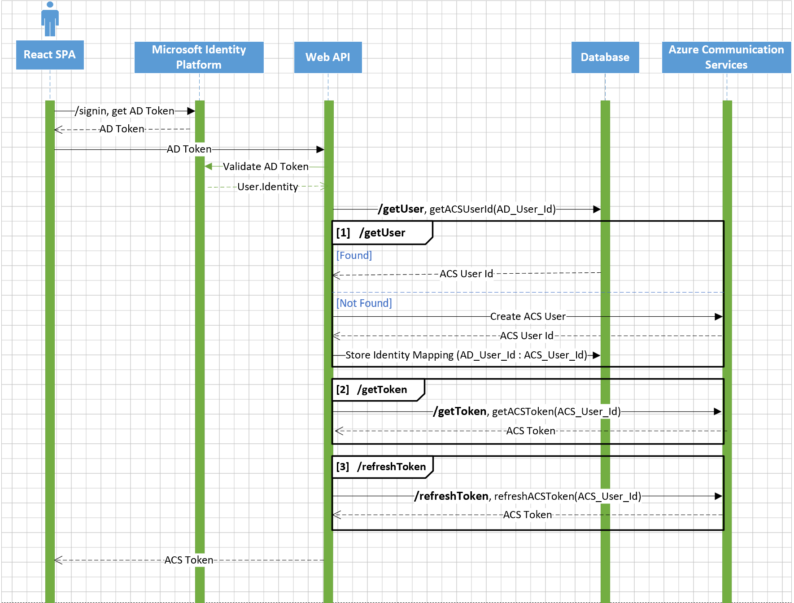

# ACS Solutions - Authentication Server Sample

1. [Overview](#overview)
2. [Features](#features)
3. [Getting Started](#getting-started)
   1. [Prerequisites](#prerequisites)
   2. [Code Structure](#code-structure)
   3. [Before running the sample for the first time](#before-running-the-sample-for-the-first-time)
   4. [Locally deploying the sample app](#locally-deploying-the-sample-app)
   5. [Troubleshooting](#troubleshooting)
   6. [Publish to Azure](#publish-to-azure)
   7. [Building off of the sample](#building-off-of-the-sample)
4. [Identity Storage Options](#Iidentity-storage-options)
5. [Resources](#resources)
6. [Known Issues](#known-issues)
7. [Trademark](#trademark)
8. [License](#license)

## Overview

In order to properly implement Azure Communication Services solutions, developers must start by putting in place the correct infrastructure to perform key actions for the communications lifecycle. These actions include authenticating users since the Azure Communication Services are identity-agnostic.

This is an ACS solution server sample to provide a guidance establishing best practices on a simple use case to bring your own identity (**BYOI**) to the Azure Communication Services by storing the mapping between Azure AD and ACS users. The solution guides below:

- Have a trusted backend service that will create ACS identities and issue access tokens.
- Have this trusted service authenticate users and maintain a mapping between a Contoso identity and an ACS identity.

> An ACS Solutions - Authentication Sample (C# version) can be found [here](https://github.com/Azure-Samples/communication-services-authentication-hero-csharp).

Additional documentation for this sample can be found on [Microsoft Docs](https://docs.microsoft.com/azure/communication-services/samples/calling-hero-sample).

Before contributing to this sample, please read our [contribution guidelines](./CONTRIBUTING.md).

## Features

This ACS Solutions - Authentication sample provides the following features:

* **/getUser** - Return an ACS user id if existing in the database, otherwise, create an ACS user and then store the identity mapping.

* **/getToken** - Get a token for an ACS user.

* **/refreshToken** - Refresh a token for an existing ACS user.

* **/exchangeToken** - Exchange an M365 token of a Teams user for an ACS token.

  > Teams users are authenticated via the MSAL library against Azure Active Directory in the client application. Authentication tokens are exchanged for Microsoft 365 Teams token via the Communication Services Identity SDK. Developers are encouraged to implement an exchange of tokens in your backend services as exchange requests are signed by credentials for Azure Communication Services. In backend services, you can require any additional authentication. Learn more information [here](https://docs.microsoft.com/en-ca/azure/communication-services/concepts/teams-interop#microsoft-365-teams-identity)

## Getting Started

### Prerequisites

- ...

### Code Structure

- ...

### Before running the sample for the first time

1. ...

### Locally deploying the sample app

1. ...

### Troubleshooting

1. ...

### Publish to Azure

1. ...

### Building off of the sample

1. ...

## Identity Storage Options

(Add a comparison table here...)

## Resources

- [Azure Communication Services User Access Management](https://docs.microsoft.com/en-ca/azure/communication-services/concepts/client-and-server-architecture#user-access-management) - Dataflows present user access tokens to access Communication Services resources securely.
- [Teams Interoperability](https://docs.microsoft.com/en-ca/azure/communication-services/concepts/teams-interop) - BYOI (Bring Your Own Identity) and Microsoft 365 authenticated interoperability for Teams.
- [Azure Active Directory B2C documentation](https://docs.microsoft.com/en-us/azure/active-directory-b2c/) - A business-to-customer identity as a service.
- [Azure Communication Services Documentation](https://docs.microsoft.com/en-us/azure/communication-services/) - Find more about how to add voice, video, chat, and telephony on our official documentation.
- [Azure Communication Services Hero Samples](https://docs.microsoft.com/en-us/azure/communication-services/samples/overview) - Find more ACS samples and examples on our samples overview page.

## Known Issues

* ...

## Trademark

**Trademarks** This project may contain trademarks or logos for projects, products, or services. Authorized use of Microsoft trademarks or logos is subject to and must follow [Microsoft’s Trademark & Brand Guidelines](https://www.microsoft.com/en-us/legal/intellectualproperty/trademarks/usage/general). Use of Microsoft trademarks or logos in modified versions of this project must not cause confusion or imply Microsoft sponsorship. Any use of third-party trademarks or logos are subject to those third-party’s policies.

## License

[MIT](LICENSE.md)

