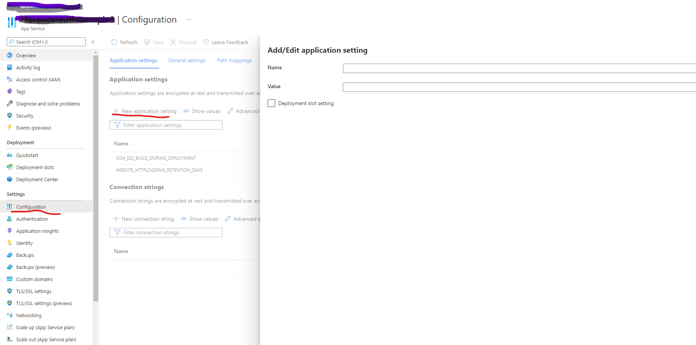
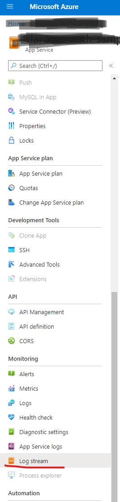

# Deploy & Test the sample on Azure

1. [Set up App Registrations] (../contribution-guides/1.get-set-up.md)


2. Deploy to Azure

    a. Please download the source code, and follow the instructions on [Deploy Node.js to Azure App Service using Visual Studio code](https://docs.microsoft.com/en-us/azure/developer/javascript/tutorial/deploy-nodejs-azure-app-service-with-visual-studio-code?tabs=bash) to deploy the whole repo. 

    b. Login in the Azure Portal, go to the `Configuration -> new Application Setting`, then create and edit environment variables on the Configuration section:

    "GraphExtensionName": "<'The name of Graph open extension representing the roaming profile information>",

    "ResourceConnectionString": "<'Connection String of the Azure user>",

    "AzureActiveDirectory_ClientId": "<Application Id from 'Overview' page of the server app>",

    "AzureActiveDirectory__ClientSecret": "<Client Secret Value from 'Certifactes & secrets' of server app>",

    "AzureActiveDirectory__TenantId": "<Tenant Id from 'Overview' page of the server app>"

    


    c. Once the deployment is successfull, the service will run automatically, which can be verified through the console log message on Azure portal (`Home -> <your_application> -> Monitoring -> Log Stream`). Then APIs can be tested using the following instructions 

    


3. Test the APIs

    a. Testing with manually generated AAD Token


    - Please follow the section Generate an Azure AD Token manually on contribution guideline

    - Invoke the API
	
	    ``` SHELL
            curl --location --request GET 'http://<replace with URL on your provisioned App Service>/api/token' \

            --header 'Authorization: Bearer <put access token here>
        ```

     b. Test the APIs using Test Client