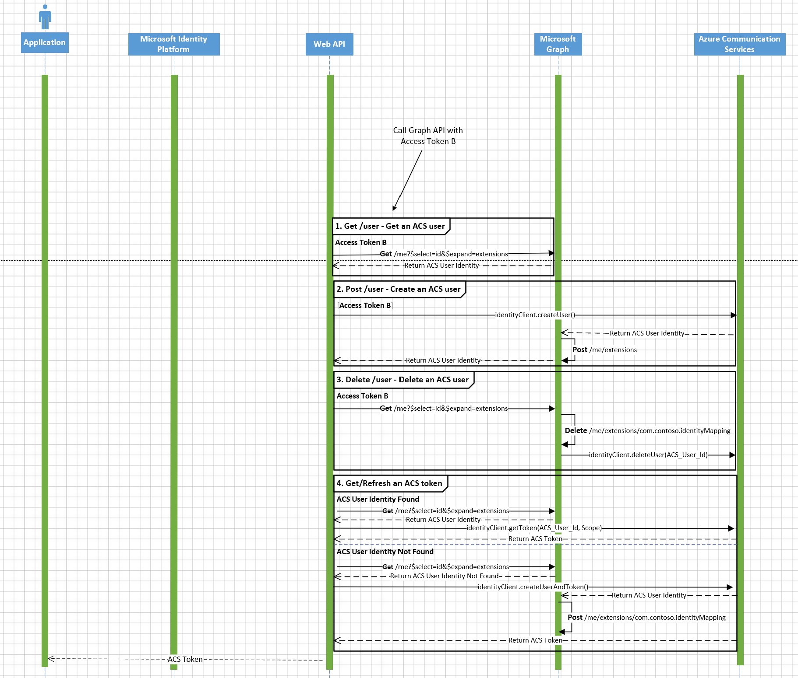

# Identity Mapping Design

## Table of content

- [Scenario](#scenario)
- [Overview](#overview)
- [The Way How to Manage](#the-way-how-to-manage)
  - [User Endpoint](#user-endpoint)
    - [GET /user](#get-user)
    - [POST /user](#post-user)
    - [DELETE /user](#delete-user)
  - [Token Endpoint](#token-endpoint)
    - [GET /token](#get-token)
- [Contributing](#contributing)
- [More Information](#more-information)

## Scenario

Since Azure Communication Services is an identity-agnostic service, customers need to build a trusted backend service that maintains the mapping relationship their business case requires instead of duplicating information in their system. For example, they can map identities 1:1, 1:N, N:1, N:M.

>External identifiers such as phone numbers, users, devices, applications, and GUIDs can't be used for identity in Azure Communication Services. Access tokens that are generated for an Azure Communication Services identity are used to access primitives such as chat or calling. To learn more, please visit [Azure Communication Services Identity Model](https://docs.microsoft.com/azure/communication-services/concepts/identity-model)

## Overview

This sample demonstrates how to use Microsoft Graph open extensions as the solution for identity mapping storage to build a trusted backend service that will manage ACS identities by mapping them 1:1 with Azure Active Directory identities (for Teams Interop or native ACS calling/chat) and issue ACS tokens.

> Note: 
> 1. Developers should not use extensions to store sensitive personally identifiable information, such as account credentials, government identification numbers, cardholder data, financial account data, healthcare information, or sensitive background information.
>
> 2. Microsoft Graph has two extension types: 
>    1. [Open extensions](https://docs.microsoft.com/graph/extensibility-overview#open-extensions)  (**Untyped** data)
>    2. [Schema extensions](https://docs.microsoft.com/graph/extensibility-overview#schema-extensions) (**Typed** data)
>
>    The reason why we use the open extensions here is that we only store simple key-value mapping in this scenario, not typed data.
>
> 3. It is worth mentioning that a maximum of **2** **open extensions** are allowed per resource instance while **schema extensions**' maximum is **5**. To learm more about known issues, please visit [Known Extensions Limitations](https://docs.microsoft.com/graph/known-issues#extensions).

## The Way How to Manage

As displayed in the ACS Authentication Server - Identity Mapping overview sequence diagram below, the identity mapping part consists of two endpoints - `/user` and `/token`

### User Endpoint

The `/user` endpoint consists of three operations:

1. **GET** - Retrieve the Azure Communication Services identity from Microsoft Graph.
2. **POST** - Add an identity mapping information in Microsoft Graph
3. **DELETE** - Delete an identity mapping information from Microsoft Graph as well as from the Azure Communication Services resource.

### Token Endpoint

The `/token` endpoint only consists of one operation:
1.  **GET** - used to **get** and **refresh** Azure Communication Services tokens

## Contributing

If you'd like to contribute to this sample, please refer to our [contribution page](../../CONTRIBUTING.md).

This project has adopted the [Microsoft Open Source Code of Conduct](https://opensource.microsoft.com/codeofconduct/). For more information, check the [Code of Conduct FAQ](https://opensource.microsoft.com/codeofconduct/faq/) or contact [opencode@microsoft.com](mailto:opencode@microsoft.com) with any additional questions or comments.

## More Information

For more information, visit the following links:

- To lean more about **Azure Communication Services - Identity**, visit:
  - [Quickstart: Create and manage access tokens](https://docs.microsoft.com/azure/communication-services/quickstarts/access-tokens?pivots=programming-language-javascript)
  - [Quickstart: Quickly create Azure Communication Services access tokens for testing](https://docs.microsoft.com/azure/communication-services/quickstarts/identity/quick-create-identity)
  - [Azure Communication Services Identity JavaScript SDK](https://azuresdkdocs.blob.core.windows.net/$web/javascript/azure-communication-identity/1.0.0/index.html)
- To learn more about **Microsoft Graph Open Extensions**, visit:
  - [Microsoft Graph Extensions Overview](https://docs.microsoft.com/graph/extensibility-overview)
  - [Add custom data to users using open extensions](https://docs.microsoft.com/graph/extensibility-open-users)
  - [Microsoft Graph Extensions Known Limitations](https://docs.microsoft.com/graph/known-issues#extensions)
