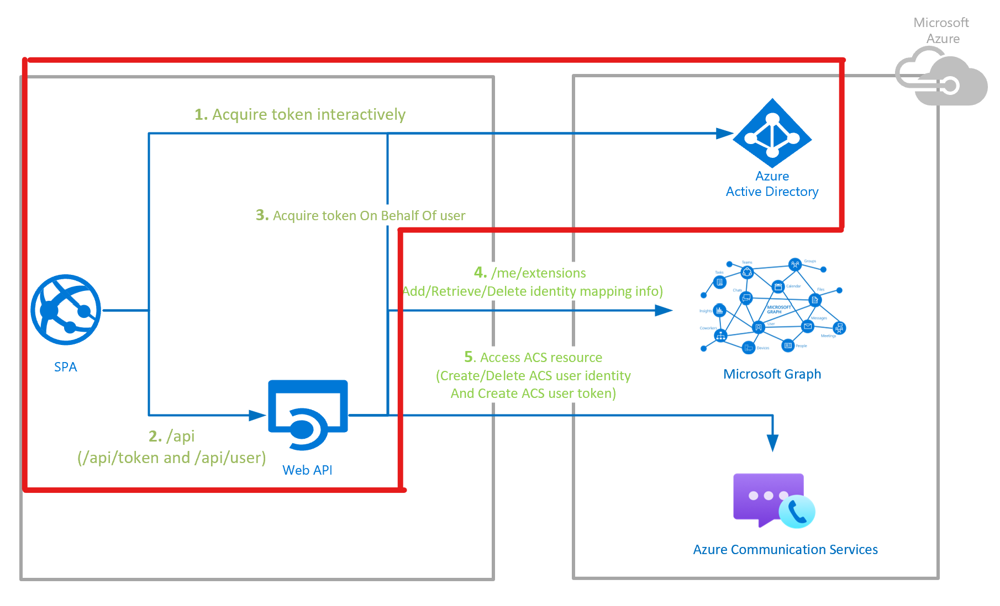
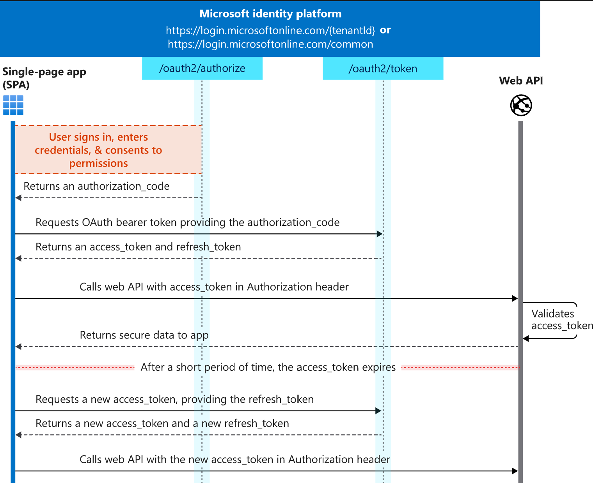
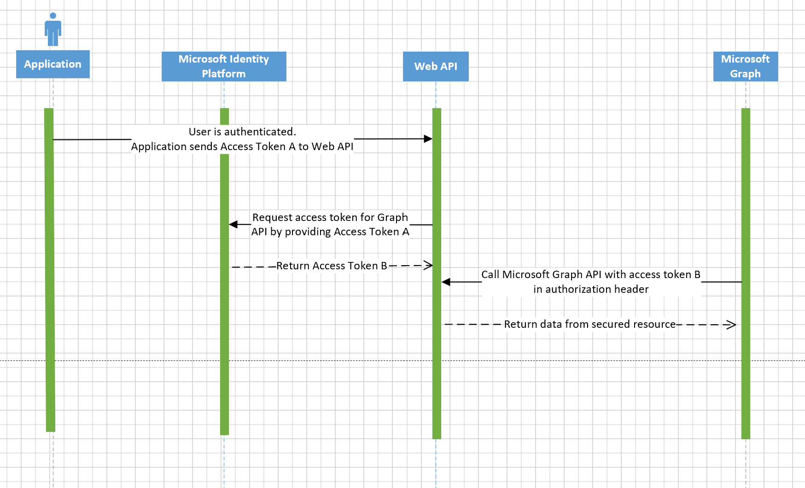

# Secured Web API Design

## Table of content

- [Scenario](#scenario)
- [Overview](#overview)
- [The Way How to Secure](#the-way-how-to-secure)
  - [Authorization Code Grant Flow (ACG Flow)](#authorization-code-grant-flow-acg-flow)
  - [On-Behalf-Of Flow (OBO Flow)](#on-behalf-of-flow-obo-flow)
- [Community Help and Support](#community-help-and-support)
- [Contributing](#contributing)
- [More Information](#more-information)

## Scenario

In this ACS Authentication Server sample, we would protect custom Web APIs using the Microsoft Identity Platform. The Web API, supporting authenticated users with personal Microsoft accounts as well as work and school accounts, will be protected using Azure Active Directory OAuth Bearer Authorization. Further on the API will also call a downstream API (Microsoft Graph) on-behalf of the signed-in user to provide additional value to its apps.

## Overview

This sample demonstrates how to allow users to authenticate and obtain an access token to call a Node.js web API, protected by [Azure Active Directory (Azure AD)](https://azure.microsoft.com/services/active-directory/) using the [OAuth 2.0 Authorization Code Grant flow](https://docs.microsoft.com/azure/active-directory/develop/v2-oauth2-auth-code-flow). The web API then calls the [Microsoft Graph API](https://developer.microsoft.com/graph) using the [OAuth 2.0 On-Behalf-Of flow](https://docs.microsoft.com/azure/active-directory/develop/v2-oauth2-on-behalf-of-flow). The web API's call to Microsoft Graph is made using the [Microsoft Graph SDK](https://docs.microsoft.com/graph/sdks/sdks-overview).

> Developers who wish to gain good familiarity of programming for Microsoft Graph are advised to go through the [An introduction to Microsoft Graph for developers](https://www.youtube.com/watch?v=EBbnpFdB92A) recorded session, also make requests and see responses against the Microsoft Graph using [Microsoft Graph explorer](https://developer.microsoft.com/graph/graph-explorer)

## The Way How to Secure

As displayed in the ACS Authentication Server flow diagram below, the secured Web API contains two parts:

1. Authenticate users to call a **Web API** through **Authorization Code Grant flow** (Client side)
2. Make authenticated requests by a Web API to call a **downstream API** through **On-Behalf-Of flow** (Server side)

**Client Side (Step 1&2):**

1. Signs-in users using the [Microsoft Authentication Library for JavaScript (MSAL.js)](https://github.com/AzureAD/microsoft-authentication-library-for-js).
2. Acquires an access token for the Web API using the Authorization Code Grant flow.
3. Calls the Nodejs Web API by using the access token as a bearer token in the Authorization header of the Http request.

**Server Side (Step 3&4):**

1. Once the user is authorized, acquires another access token on behalf of the signed-in user using the On-Behalf-Of flow.
2. The Web API then uses this new Access token to call downstream APIs (Microsoft Graph here).

### Authorization Code Grant Flow (ACG Flow)

In order to gain access to protected resources, such as web APIs, the application needs to obtain an authentication code from the Microsoft identity platform `authorize` endpoint (`https://login.microsoftonline.com/common/oauth2/v2.0/authorize`), and redeems it for an access token using the Microsoft identity platform `token` endpoint (`https://login.microsoftonline.com/common/oauth2/v2.0/token`) and a refresh token using cross-site web requests. The access token expires every 24 hours, and the application must request another code using the refresh token.

>The OAuth 2.0 authorization code grant can be used in apps that are installed on a device to gain access to protected resources, such as web APIs. Know more, please visit [Microsoft identity platform and OAuth 2.0 authorization code flow](https://docs.microsoft.com/azure/active-directory/develop/v2-oauth2-auth-code-flow)

:information_source: It is worth mentioning that the Authorization Code Grant Flow (ACG Flow) is implemented at **client side** which is excluded from this ACS Authentication Server Sample. Therefore, users need to either integrate the ACG flow into their client applications or manually generate the access token via the ACG flow following our [Run Authentication Server Sample](../contribution-guides/3. run-authentication-sample.md) guide.

The steps that follow constitute the ACG flow and are explained with the help of the following diagram.

1. **Request an authorization code**

   1. User signs in with credentials and consents to permissions indicated in the `scope` query parameter through the SPA.

      > If the user has not consented to any of those permissions, it will ask the user to consent to the required permissions. Details of [permissions, consent, and multi-tenant apps are provided here](https://docs.microsoft.com/en-us/azure/active-directory/develop/v2-permissions-and-consent).

   2. The user is directed to the `authorize` endpoint for authentication and consent grant.

   3. Once the user authenticates and grants consent, the Microsoft identity platform will return a response containing  an authentication code to the SPA at the indicated `redirect_uri`.

2.  **Redeem a code for an access token**

   1. The SPA redeems the authentication code for an access token and a refresh token using cross-site web requests. through `token` endpoint.

      > The access token expires every 24 hours, and the app must request another code using the refresh token.

   2. Once the SPA receives the access token, it can use it to call Web APIs in the Authorization header.

### On-Behalf-Of Flow (OBO Flow)

In many cases, web APIs also need to make outbound requests to other downstream web APIs secured by Microsoft identity platform. To do so, web APIs can take advantage of the **On-Behalf-Of** flow, which allows the web API to exchange an incoming access token for another access token to be used in outbound requests.

Therefore, after authenticating on an application using the OAuth 2.0 authorization code grant flow, the application now has an access token for Web API with the user's claims and consent to access the middle-tier web API. Now, Web API needs to make an authenticated request to the downstream API (Microsoft Graph in this sample).

> The OAuth 2.0 On-Behalf-Of flow (OBO) serves the use case where an application invokes a service/web API, which in turn needs to call another service/web API. The idea is to propagate the delegated user identity and permissions through the request chain. For the middle-tier service to make authenticated requests to the downstream service, it needs to secure an access token from the Microsoft identity platform, on behalf of the user. Know more, please visit [Microsoft identity platform and OAuth 2.0 On-Behalf-Of flow](https://docs.microsoft.com/azure/active-directory/develop/v2-oauth2-on-behalf-of-flow)

:information_source: It is worth mentioning that the On-Behalf-Of Flow (OBO Flow) is already integrated into this ACS Authentication Server sample. Users only to need to follow our documentations in **contribution guides** folder to make it work.

The steps that follow constitute the OBO flow and are explained with the help of the following diagram.

1. The application makes a request to Web API with token A obtained from previous step via the Authorization Code Grant flow.
2. The Web API authenticates to the Microsoft identity platform token issuance endpoint and requests a token to access the downstream API (Microsoft Graph API here).
3. The Microsoft identity platform token issuance endpoint validates the Web API's credentials along with token A and issues the access token for the downstream Microsoft Graph API (token B) to the Web API.
4. Token B is set by the Web API in the authorization header of the request to the downstream Microsoft Graph API.
5. Data from the secured resource is returned by the downstream Microsoft Graph API to the Web API then to the SPA.

## Community Help and Support

Use [Stack Overflow](http://stackoverflow.com/questions/tagged/msal) to get support from the community. Ask your questions on Stack Overflow first and browse existing issues to see if someone has asked your question before. Make sure that your questions or comments are tagged with [`azure-active-directory` `msal` `node.js`].

If you find a bug in the sample, please raise the issue on [GitHub Issues](https://github.com/Azure-Samples/communication-services-authentication-hero-nodejs/issues).

## Contributing

If you'd like to contribute to this sample, see [CONTRIBUTING.MD](../../CONTRIBUTING.md).

This project has adopted the [Microsoft Open Source Code of Conduct](https://opensource.microsoft.com/codeofconduct/). For more information, see the [Code of Conduct FAQ](https://opensource.microsoft.com/codeofconduct/faq/) or contact [opencode@microsoft.com](mailto:opencode@microsoft.com) with any additional questions or comments.

## More Information

For more information, visit the following links:

- To lean more about **application registration**, visit:

  - [Quickstart: Register an application with the Microsoft identity platform (Preview)](https://docs.microsoft.com/azure/active-directory/develop/quickstart-register-app)
  - [Quickstart: Configure a client application to access web APIs (Preview)](https://docs.microsoft.com/azure/active-directory/develop/quickstart-configure-app-access-web-apis)
  - [Quickstart: Configure an application to expose web APIs (Preview)](https://docs.microsoft.com/azure/active-directory/develop/quickstart-configure-app-expose-web-apis)
- To learn more about **Microsoft identity platform**: visit:
  - [Microsoft identity platform - Supported Authentication Flows Scenarios](https://docs.microsoft.com/azure/active-directory/develop/msal-authentication-flows)
  - [Microsoft identity platform - Application Types](https://docs.microsoft.com/azure/active-directory/develop/v2-app-types)
  - [Microsoft identity platform - OAuth 2.0 Authorization Code flow](https://docs.microsoft.com/azure/active-directory/develop/v2-oauth2-auth-code-flow)
  - [Tutorial: Sign in users and call the Microsoft Graph API from a JavaScript single-page app (SPA) using auth code flow](https://docs.microsoft.com/azure/active-directory/develop/tutorial-v2-javascript-auth-code)
  - [Microsoft identity platform - OAuth 2.0 On-Behalf-Of flow](https://docs.microsoft.com/azure/active-directory/develop/v2-oauth2-on-behalf-of-flow)
  - [MSAL Node Standalone Sample: On-Behalf-Of Flow](https://github.com/AzureAD/microsoft-authentication-library-for-js/blob/dev/samples/msal-node-samples/on-behalf-of/README.md)
  - [Microsoft Authentication Library for JavaScript (MSAL.js) Samples](https://github.com/AzureAD/microsoft-authentication-library-for-js/tree/dev/samples)
