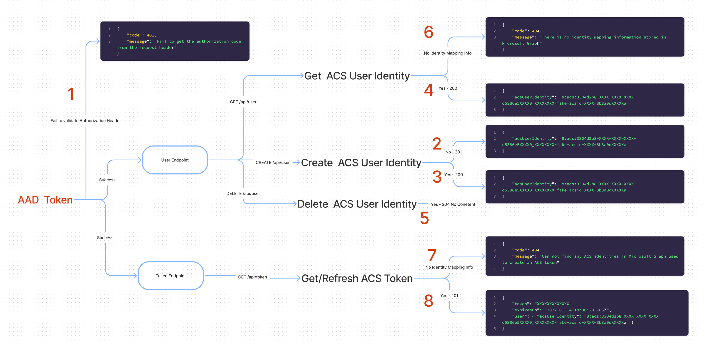

# Endpoints and Responses

## User Endpoint

The `user` endpoint consists of three operations:

1. **GET /api/user** - Retrieve an Azure Communication Services identity from Microsoft Graph.
2. **POST /api/user** - Create an Azure Communication Services identity and then add the roaming identity mapping information to Microsoft Graph.
3. **DELETE /api/user** - Delete an identity mapping information from Microsoft Graph including the Azure Communication Services resource related to the Azure Communication Services identity.

## Token Endpoint

The `token` endpoint only consists of two operations:

1. **GET /api/token** - Get / refresh an Azure Communication Services token for an Azure Communication Services user.
2. [**GET /api/token/teams**](./token-exchange-design.md) - Exchange an Microsoft Entra token of a M365 user for an Azure Communication Services token.

> :information_source: Teams users are authenticated via the MSAL library against Microsoft Entra ID in the client application. Authentication tokens are exchanged for Microsoft 365 Teams token via the Azure Communication Services Identity SDK. Developers are encouraged to implement an exchange of tokens in their backend services as exchange requests are signed by credentials for Azure Communication Services. In backend services, developers can require any additional authentication. Learn more [here](https://docs.microsoft.com/azure/communication-services/concepts/teams-interop#microsoft-365-teams-identity).

