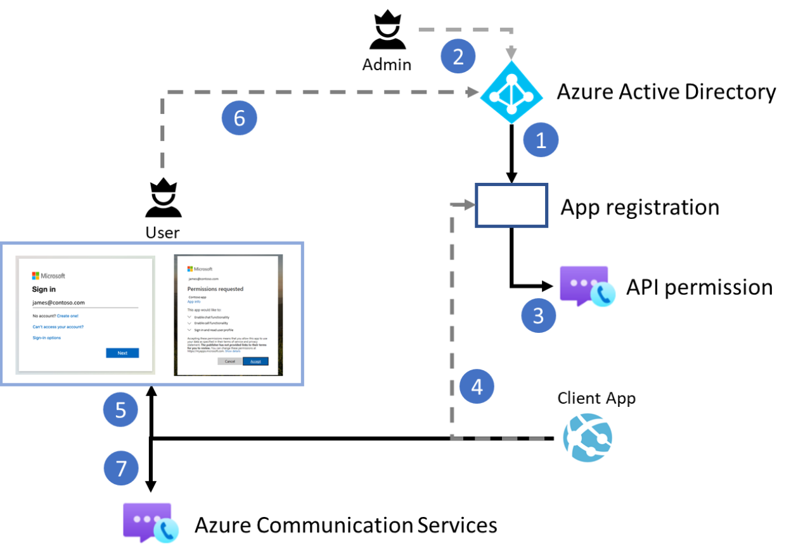

# Token Exchange Design

## Table of content

- [Scenario](#scenario)
- [Overview](#overview)
- [How Token Exchange Works](#how-token-exchange-works)
- [Contributing](#contributing)
- [More Information](#more-information)

## Scenario

As you may know, Azure Communication Services SDKs has the ability to allow developers to build custom applications that are usable by Teams users using **Custom Teams Endpoints**. Developers can build custom Teams endpoints to communicate with the Microsoft Teams client or other custom Teams endpoints. With a custom Teams endpoint, they can customize a voice, video, chat, and screen-sharing experience for Teams users.

## Overview

In this Azure Communication Services Authentication Server sample, we would describe how developers can authenticate a Microsoft 365 user by using the Microsoft Authentication Library (MSAL) and retrieving a Microsoft Azure Active Directory (Azure AD) user token. They will then exchange that token for an access token of Teams user with the Azure Communication Services Identity SDK. The access token for Teams user can then be used by the Communication Services Calling SDK to build a custom Teams endpoint.

> :bangbang: Important: 
>
> 1. Functionality described in this document is currently in public preview. This preview version is provided without a service-level agreement, and it's not recommended for production workloads. Certain features might not be supported or might have constrained capabilities. For more information, see [Supplemental Terms of Use for Microsoft Azure Previews](https://azure.microsoft.com/support/legal/preview-supplemental-terms/).
> 2. When you're in a production environment, we recommend that you implement this exchange mechanism in back-end services, because requests for an exchange are signed with a secret.

## How Token Exchange Works

As displayed in the Azure Communication Services Authentication Server - Token Exchange flow diagram below, the **Token Exchange for single tenant** includes two steps:

1. From the **Client side**, the developer configures the Microsoft Authentication Library (MSAL) to authenticate the Microsoft 365 user for the application that was created earlier for Communication Services **Teams.ManageCalls** permission, in order to to obtain Microsoft Azure Active Directory (Azure AD) user tokens using **Authorization Code Grant flow**.
2. From the **Server side**, the developer initializes the **Azure Communication Services Identity SDK** and exchanges the incoming Azure AD user token for the access token of Teams user via the identity SDK. The access token of Teams user is then returned to the client application.

## Contributing

If you'd like to contribute to this sample, see [CONTRIBUTING.MD](../../CONTRIBUTING.md).

This project has adopted the [Microsoft Open Source Code of Conduct](https://opensource.microsoft.com/codeofconduct/). For more information, see the [Code of Conduct FAQ](https://opensource.microsoft.com/codeofconduct/faq/) or contact [opencode@microsoft.com](mailto:opencode@microsoft.com) with any additional questions or comments.

## More Information

For more information, visit the following links:

- To learn more about the scenario, visit:
  - [Custom Teams Endpoint Overview](https://docs.microsoft.com/azure/communication-services/concepts/teams-endpoint)
  - [Build a custom Teams endpoint](https://docs.microsoft.com/azure/communication-services/concepts/teams-endpoint)
- To learn more about the Teams Access Token Management, visit:
  - [Quickstart: Set up and manage access tokens for Teams users](https://docs.microsoft.com/azure/communication-services/quickstarts/manage-teams-identity?pivots=programming-language-javascript)